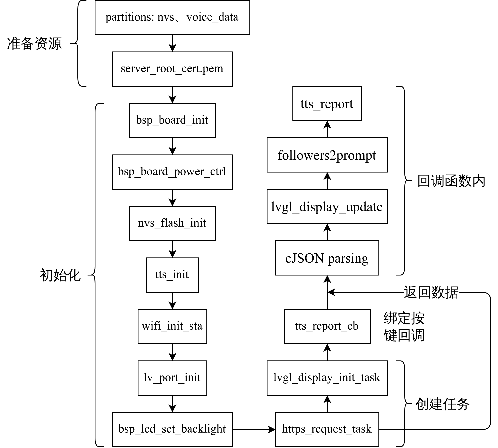

ESP32-S3-BOX-Lite Bfans TTS
===========================

基于ESP32-S3-BOX-Lite，使用esp-idf开发，连接WiFi并发出HTTPS请求，返回B站用户数据信息，再使用cJSON完成json数据解析，得到用户粉丝数，最后通过TTS实现语音合成与播报。

# 📦 Prerequisites

开发环境 [esp-idf `v4.4.4`](https://github.com/espressif/esp-idf/tree/v4.4.4) 与 [esp-box `v0.3.0`](https://github.com/espressif/esp-box/tree/v0.3.0)

# 🛠️ How to run

1. 修改 [`./CMakeLists.txt`](CMakeLists.txt) 中 `EXTRA_COMPONENT_DIRS` 为实际路径

   ```cmake
   set(EXTRA_COMPONENT_DIRS ../esp-box/components)
   ```
2. 修改 [`main/CMakeLists.txt`](main/CMakeLists.txt) 中 `voice_data_image` 为实际路径：

   ```cmake
   set(voice_data_image ${PROJECT_DIR}/../esp-box/components/esp-sr/esp-tts/esp_tts_chinese/esp_tts_voice_data_xiaole.dat)
   ```
3. 如果是对 `api.bilibili.com` 发出HTTPS请求，可直接使用 [`server_root_cert.pem`](resources/server_root_cert.pem)，否则需要按照 [`main/src/https_req.c`](main/src/https_req.c) 内50~58行所述生成 `server_root_cert.pem` 文件。确保 [`main/component.mk`](main/component.mk) 内 `COMPONENT_EMBED_TXTFILES` 与 [`main/CMakeLists.txt`](main/CMakeLists.txt) 中 `EMBED_TXTFILES` 指向 `server_root_cert.pem` 文件。

   ```cmake
   // In main/component.mk
   COMPONENT_EMBED_TXTFILES := ../resources/server_root_cert.pem

   // In main/CMakeLists.txt
   idf_component_register(
       SRCS ${srcs}
       INCLUDE_DIRS ${include_dirs}
       EMBED_TXTFILES ${PROJECT_DIR}/resources/server_root_cert.pem)
   ```
4. 修改 [`main/include/config.h`](main/include/config.h)：

   ```c
   #define BILIBILI_VMID   "Bilibili UID"
   #define WIFI_SSID       "WIFI SSID"
   #define WIFI_PASSWORD   "WIFI PASSWORD"
   ```
5. 进入idf环境，并编译

   ```shell
   idf.py build
   ```

# 📜 Documentation

## ⚙️ Workflow



## 📽️ More details

1. 项目详细说明，[CSDN：基于ESP32-S3-BOX-Lite的语音合成与播报系统(esp-idf+WiFi+HTTPS+TTS)](https://blog.csdn.net/weixin_46422143/article/details/131744806)
2. 项目效果演示，[B站：基于ESP32-S3-BOX-Lite的语音合成与播报系统](https://www.bilibili.com/video/BV1XX4y1J7xT)
